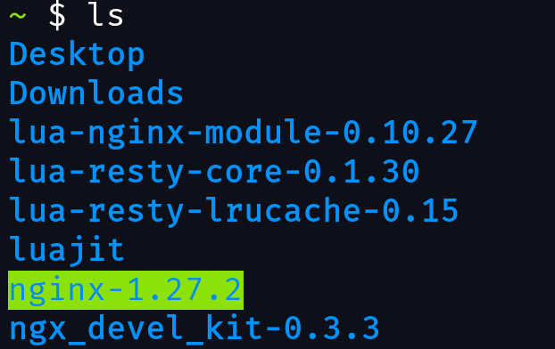

# 0.自己配置的原因
因为Openresty官方预编译的包没有aarch64架构的（或者说，Termux不能安装arm64架构的包），而我的手机是aarch64架构的，所以不能直接使用预编译包。并且，Openresty官方的源码包在Termux中打包会出现各种问题（例如MAXNS的问题）。

# 1.下载
下载依赖
```bash
pkg install pcre perl make build-essential binutils-is-llvm git
```
下载LuaJit
```
cd
git clone https://luajit.org/git/luajit.git
```
下载[nginx最新版](https://nginx.org)

下载[ngx_devel-kit module最新版](https://github.com/simplresty/ngx_devel_kit/tags)

下载[lua_nginx_module最新版](https://github.com/openresty/lua-nginx-module/tags)

下载[lua-resty-core最新版](https://github.com/openresty/lua-resty-core)

下载[lua-resty-lrucache最新版](https://github.com/openresty/lua-resty-lrucache)

解压到home备用。

# 2.安装LuaJit
由于我的手机是8核处理器，所以接下来执行`make`的时候加了`-j8`参数。

注意要指定所有的安装目录，因为安卓系统的根目录没办法访问。
```bash
cd luajit
make install PREFIX=/data/data/com.termux/files/usr -j8
```

# 3.配置环境变量
在`/data/data/com.termux/files/usr/etc/profile`中添加两个环境变量`LUAJIT_LIB`和`LUAJIT_INC`，然后在`PATH`中添加`/data/data/com.termux/files/usr/sbin`。

（下图是我用[Termux的图形化界面](https://blog.csdn.net/gitblog_09070/article/details/142232152#:~:text=%E5%AE%89%E8%A3%85%E6%AD%A5%E9%AA%A4.)拍的）

# 4.配置nginx
这里我是直接安装到`/data/data/com.termux/files/usr/`中。
```bash
cd nginx-1.27.2
chmod 777 -R .
./configure --prefix=/data/data/com.termux/files/usr --sbin-path=/data/data/com.termux/files/usr/sbin/nginx --modules-path=/data/data/com.termux/files/usr/lib/nginx/modules --conf-path=/data/data/com.termux/files/usr/etc/nginx/nginx.conf --error-log-path=/data/data/com.termux/files/usr/var/log/nginx/error.log --http-log-path=/data/data/com.termux/files/usr/var/log/nginx/access.log --pid-path=/data/data/com.termux/files/usr/tmp/nginx.pid --lock-path=/data/data/com.termux/files/usr/tmp/nginx.lock --http-client-body-temp-path=/data/data/com.termux/files/usr/var/cache/nginx/client_temp --http-proxy-temp-path=/data/data/com.termux/files/usr/var/cache/nginx/proxy_temp --http-fastcgi-temp-path=/data/data/com.termux/files/usr/var/cache/nginx/fastcgi_temp --http-uwsgi-temp-path=/data/data/com.termux/files/usr/var/cache/nginx/uwsgi_temp --http-scgi-temp-path=/data/data/com.termux/files/usr/var/cache/nginx/scgi_temp --user=nginx --group=nginx --with-compat --with-file-aio --with-threads --with-http_addition_module --with-http_auth_request_module --with-http_dav_module --with-http_flv_module --with-http_gunzip_module --with-http_gzip_static_module --with-http_mp4_module --with-http_random_index_module --with-http_realip_module --with-http_secure_link_module --with-http_slice_module --with-http_ssl_module --with-http_stub_status_module --with-http_sub_module --with-http_v2_module --with-mail --with-mail_ssl_module --with-stream --with-stream_realip_module --with-stream_ssl_module --with-stream_ssl_preread_module --with-cc-opt='-O2 -g -pipe -Wall -Wp,-D_FORTIFY_SOURCE=2 -fexceptions -fstack-protector-strong --param=ssp-buffer-size=4 -grecord-gcc-switches -m64 -mtune=generic -fPIC' --with-ld-opt='-Wl,-z,relro -Wl,-z,now -pie -lcrypt' --add-module=/data/data/com.termux/files/home/ngx_devel_kit-0.3.3 --add-module=/data/data/com.termux/files/home/lua-nginx-module-0.10.27
```
注意：

* 参数`--with-ld-opt`中需要加`-lcrypt`，否则会出现找不到`crypt`的问题。

* `--add-module`为ngx_devel_kit和lua-nginx-module的路径。

配置好后，打开`/nginx-1.27.2/objs/Makefile`，搜索`-Werror`，把它删掉，防止产生的警告影响编译。

然后开始编译。
```bash
make -j8
```
这时会有下面的错误：


找到这些错误对应的h文件，把前面的修饰`( __poll_t)`删掉。（我这里删了`EPOLLIN`、`EPOLLOUT`和`EPOLLRDHUP`）

再次编译。
```bash
make -j8
```
编译成功，安装
```bash
make install
```
# 5.配置resty
```bash
cd lua-resty-core-0.1.30
make install PREFIX=/data/data/com.termux/files/usr -j8
cd
cd lua-resty-lrucache-0.15
make install PREFIX=/data/data/com.termux/files/usr -j8
```
# 6.启动nginx
划掉后台或者新建一个会话（目的是刷新环境变量），然后运行
```bash
nginx
```
