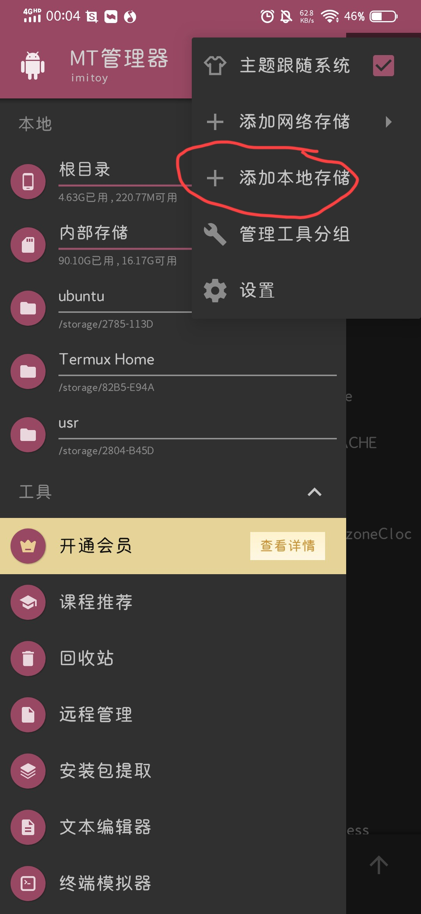
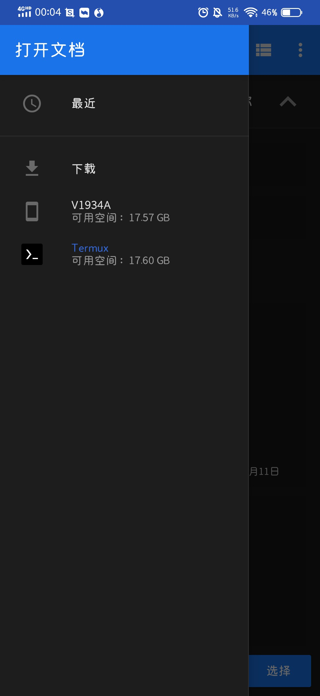

# 1.安装Linux发行版
（不安装据说是不太行的）
首先需要安装Linux发行版，这里我以Ubuntu为例。
```bash
pkg update
pkg upgrade -y
pkg install proot-distro -y
proot-distro install ubuntu
```
如果下载慢，可以换其它渠道下载到本地，然后复制到缓存文件夹：
```bash
cp /storage/emulated/0/Download/Termux/ubuntu-noble-aarch64-pd-v4.11.0.tar.xz $PREFIX/var/lib/proot-distro/dlcache
```
复制过去之后再安装
```bash
proot-distro install ubuntu
```
如果用MT管理器，可以在MT里添加快捷方式
首先链接到home下
```bash
ln -s /data/data/com.termux/files/usr/var/lib/proot-distro/installed-rootfs/ubuntu /data/data/com.termux/files/home/ubuntu
```
然后在MT管理器中点击“添加内部存储”


在左侧点击Termux，右侧选择ubuntu文件夹，然后点击选择。


150/10000